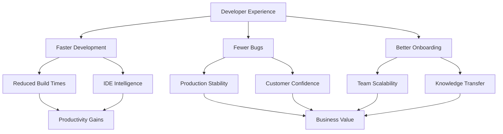
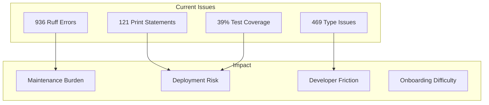
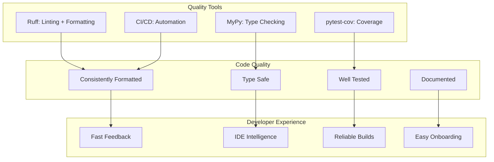
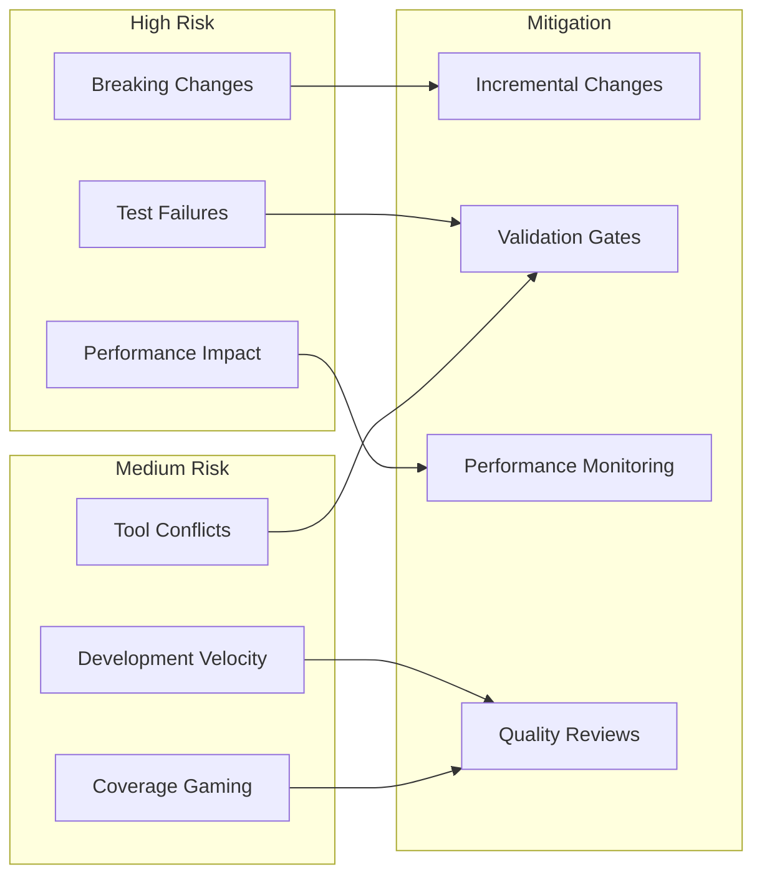

# Auto-SBM Code Quality Improvement Initiative - PRD

## Executive Summary

Transform the auto-sbm codebase from functional prototype to production-grade software by systematically addressing 936 code quality issues, implementing comprehensive type safety, and achieving 80%+ test coverage. This initiative will reduce maintenance burden, improve developer experience, and establish the foundation for reliable long-term development.

## Problem & Solution

### Problem Statement

The auto-sbm tool successfully performs SCSS migrations but suffers from critical technical debt:
- **936 ruff linting errors** causing maintenance friction
- **469 type annotation issues** preventing reliable type checking
- **~39% test coverage** (12 tests for 31 source files) creating deployment risk
- **Documentation-reality gap** confusing new developers
- **121 print statements** in production code hindering debugging

### Solution Overview

Implement a phased quality improvement program using industry-standard tools (Ruff, MyPy, pytest-cov) with strategic prioritization based on risk and impact. Transform the codebase while maintaining feature stability through comprehensive validation loops.

## User Stories & Impact Analysis



### Epic 1: Type Safety Implementation

**As a** developer  
**I want** comprehensive type annotations and MyPy compliance  
**So that** I catch bugs early and have reliable IDE support  

**Acceptance Criteria:**
- [ ] All 469 type annotation issues resolved
- [ ] MyPy passes with zero errors
- [ ] Python 3.9+ compatibility maintained
- [ ] IDE autocomplete works reliably

### Epic 2: Code Quality Standardization

**As a** team member  
**I want** consistent code formatting and linting  
**So that** code reviews focus on logic instead of style  

**Acceptance Criteria:**
- [ ] Ruff errors reduced from 936 to <100
- [ ] All print statements replaced with proper logging
- [ ] Line length violations fixed (<100 chars)
- [ ] Modern pathlib usage implemented

### Epic 3: Test Coverage & Reliability

**As a** DevOps engineer  
**I want** comprehensive test coverage with CI/CD integration  
**So that** deployments are reliable and regressions are caught early  

**Acceptance Criteria:**
- [ ] Test coverage increased from ~39% to 80%+
- [ ] All critical migration paths tested
- [ ] Error handling scenarios covered
- [ ] CI/CD pipeline validates quality gates

## Technical Architecture

### Current State Analysis



### Target Architecture



### Implementation Phases

```mermaid
gantt
    title Quality Improvement Timeline
    dateFormat X
    axisFormat %s
    
    section Phase 1: Critical
    Environment Setup    :p1, 0, 8h
    Type Compatibility   :p2, after p1, 4h
    Import Organization  :p3, after p2, 2h
    
    section Phase 2: Foundation
    Type Annotations     :p4, after p3, 16h
    Print Statement Fix  :p5, after p3, 4h
    Line Length Fix      :p6, after p5, 2h
    
    section Phase 3: Testing
    Core Logic Tests     :p7, after p4, 12h
    UI Component Tests   :p8, after p7, 8h
    Integration Tests    :p9, after p8, 8h
    
    section Phase 4: Polish
    Documentation        :p10, after p6, 4h
    Performance Opt      :p11, after p9, 6h
    Security Audit       :p12, after p11, 4h
```



## Implementation Blueprint

### Data Models & Structure

Current structure uses inline models and basic configuration. Target structure implements comprehensive type safety:

```python
# Current: Basic configuration
class Config:
    def get_setting(self, key: str, default=None):
        return self._settings.get(key, default)

# Target: Pydantic v2 with full validation
from pydantic import BaseModel, Field, field_validator
from pydantic_settings import BaseSettings

class MigrationSettings(BaseModel):
    cleanup_snapshots: bool = Field(default=True)
    create_backups: bool = Field(default=True)
    max_concurrent_files: int = Field(default=10, ge=1, le=50)
    
    @field_validator('max_concurrent_files')
    @classmethod
    def validate_concurrency(cls, v: int) -> int:
        if v > 50:
            raise ValueError('Too many concurrent files')
        return v
```

### Task Implementation Plan

```yaml
Phase 1 - Critical Infrastructure (8 hours):
  Task 1.1 - Environment Setup:
    MODIFY pyproject.toml:
      - REMOVE duplicate Python 3.9 classifier (line 23)
      - UPDATE target-version from "py38" to "py39" (line 82)
      - ADD missing dev dependencies: types-requests, types-PyYAML
    
    VERIFY environment:
      - RUN: pip install pydantic pydantic-settings mypy
      - TEST: python -c "import pydantic; print('OK')"

  Task 1.2 - Python Compatibility:
    MODIFY sbm/utils/helpers.py:
      - REPLACE "X | Y" union syntax with "Union[X, Y]" (line 87)
      - ADD: from typing import Union, Optional
    
    MODIFY sbm/config.py:
      - ENSURE all Pydantic imports work
      - VERIFY field_validator decorators

  Task 1.3 - Import Organization:
    TARGET: Fix 71 PLC0415 violations
    PATTERN: Move all imports to module top-level
    MODIFY sbm/cli.py:
      - MOVE local imports from functions to top (lines 566, 641-644)
      - REMOVE unused datetime imports

Phase 2 - Type Safety & Code Quality (22 hours):
  Task 2.1 - Type Annotations (16 hours):
    PRIORITY ORDER:
      1. Public functions (76 ANN201 issues)
      2. Function parameters (305 ANN001 issues)  
      3. Private functions (88 ANN202 issues)
    
    START WITH: sbm/utils/helpers.py (infrastructure)
    PATTERN:
      def get_branch_name(theme_name: str) -> str:
          """Generate standardized branch name for theme."""
    
    THEN: sbm/core/migration.py (core logic)
    THEN: sbm/scss/processor.py (transformation)

  Task 2.2 - Logging Migration (4 hours):
    TARGET: Replace 121 print statements
    PATTERN:
      # OLD: print(f"Processing {theme_name}")
      # NEW: logger.info("Processing %s", theme_name)
    
    PRESERVE: print statements in setup scripts and tests
    MODIFY: sbm/cli.py, sbm/core/, sbm/scss/

  Task 2.3 - Formatting & Style (2 hours):
    RUN: ruff check . --fix  # Auto-fix 61 whitespace issues
    MANUAL: Fix 104 line length violations
    PATTERN: Break long lines at logical points

Phase 3 - Test Coverage (28 hours):
  Task 3.1 - Core Logic Testing (12 hours):
    CREATE: tests/test_core/
    PATTERN: Mirror existing test structure
    
    CRITICAL TESTS:
      - test_migration_workflow.py (end-to-end migration)
      - test_scss_processor.py (transformation logic)
      - test_git_operations.py (Git workflow)
    
    COVERAGE TARGET: Core business logic

  Task 3.2 - UI Component Testing (8 hours):
    ENHANCE: tests/test_ui/
    FOCUS: Rich UI components without mocking internals
    PATTERN: Use console capture for output validation
    
    FIX: MockStat object issues in file tests
    PATTERN: Use pytest fixtures for Rich objects

  Task 3.3 - Integration Testing (8 hours):
    CREATE: tests/integration/
    TESTS:
      - Full theme migration workflow
      - CLI command integration
      - Error recovery scenarios
    
    SETUP: Test themes and mock environments

Phase 4 - Documentation & Polish (14 hours):
  Task 4.1 - Documentation Alignment (4 hours):
    UPDATE: CLAUDE.md to match actual structure
    CORRECT: Architecture claims (vertical vs horizontal)
    ALIGN: Coverage statistics with reality

  Task 4.2 - Performance Optimization (6 hours):
    MIGRATE: os.path to pathlib (172 PTH issues)
    FIX: Logging performance (33 G004 issues)
    OPTIMIZE: Error handling patterns

  Task 4.3 - Security Audit (4 hours):
    REVIEW: 4 S602 subprocess security issues
    AUDIT: 2 S105 hardcoded credential issues
    VALIDATE: Input sanitization
```

### Integration Points

```yaml
CI/CD Pipeline:
  pre-commit:
    - "ruff check . --fix"
    - "mypy sbm/"
    - "pytest tests/ --cov=sbm --cov-fail-under=80"
  
  GitHub Actions:
    - add: .github/workflows/quality.yml
    - checks: [linting, type-checking, tests, coverage]
    - gates: All checks must pass

Configuration:
  pyproject.toml:
    - update: tool.pytest.ini_options coverage threshold
    - add: tool.coverage.report exclude_lines
    - ensure: mypy strict mode configuration

Development Workflow:
  pre-commit hooks:
    - ruff check --fix
    - mypy check
    - pytest with coverage
```

## Validation Loop

### Level 1: Environment & Syntax

```bash
# Critical: Run FIRST before any code changes
python -c "import pydantic, mypy, pytest; print('Environment OK')"
ruff check sbm/ --fix  # Auto-fix what's possible
mypy sbm/              # Must pass with zero errors

# Expected: Clean environment, no import errors
```

### Level 2: Incremental Quality Gates

```bash
# After each task completion:
ruff check sbm/ --statistics  # Track error reduction
mypy sbm/ --report .mypy_cache/  # Track type coverage
pytest tests/ --cov=sbm --cov-report=term-missing  # Track test coverage

# Success Criteria per Phase:
# Phase 1: Environment setup works, critical imports resolved
# Phase 2: Ruff errors <500, MyPy errors <100, Coverage >50%
# Phase 3: Ruff errors <100, MyPy clean, Coverage >80%
```

### Level 3: Functional Validation

```bash
# Integration test - actual migration workflow
cd ~/di-websites-platform
sbm migrate test-theme --skip-post-migration

# Expected: Migration completes without errors
# Logs: Clear, informative, no debugging prints
# Files: Generated correctly with proper formatting
```

### Level 4: Quality Metrics

```bash
# Comprehensive quality assessment
pytest tests/ -v --cov=sbm --cov-report=html
ruff check . --statistics > quality_metrics.txt
mypy sbm/ --html-report .mypy_cache/html

# Review generated reports for:
# - Test coverage gaps
# - Remaining code quality issues
# - Type safety completeness
```

## Success Metrics & KPIs

### Quantitative Targets

| Metric | Current | Target | Phase 1 | Phase 2 | Phase 3 |
|--------|---------|--------|---------|---------|---------|
| Ruff Errors | 936 | <100 | <800 | <400 | <100 |
| Type Coverage | ~0% | >90% | >20% | >60% | >90% |
| Test Coverage | ~39% | >80% | >45% | >65% | >80% |
| MyPy Errors | 469+ | 0 | <300 | <100 | 0 |

### Qualitative Outcomes

- **Developer Experience**: New team members productive within 1 day
- **Deployment Confidence**: Zero production issues from code quality
- **Maintenance Burden**: 50% reduction in debugging time
- **IDE Experience**: Full autocomplete and error detection

## Risk Assessment & Mitigation



### Risk Mitigation Strategies

**Breaking Changes Prevention**:
- Small, incremental changes with validation
- Maintain feature parity throughout process
- Comprehensive regression testing at each phase

**Quality Over Quantity**:
- Focus coverage on critical business logic first
- Manual review of all test additions
- Meaningful tests over coverage percentage gaming

**Performance Monitoring**:
- Benchmark migration times before/after changes
- Monitor build times and CI/CD performance
- Profile memory usage during large migrations

## Implementation Timeline

### Phase 1: Critical Foundation (Week 1)
- Environment setup and dependency resolution
- Python compatibility fixes
- Import organization cleanup
- **Milestone**: Clean development environment

### Phase 2: Core Quality (Weeks 2-3)
- Type annotation implementation
- Print statement migration to logging
- Code formatting standardization
- **Milestone**: <400 ruff errors, MyPy mostly clean

### Phase 3: Test Coverage (Weeks 4-5)
- Core business logic testing
- UI component test fixes
- Integration test development
- **Milestone**: >80% test coverage

### Phase 4: Production Ready (Week 6)
- Documentation alignment
- Performance optimization
- Security audit completion
- **Milestone**: Production-grade codebase

## Appendices

### A. Tool Configuration

**pyproject.toml updates:**
```toml
[tool.ruff]
line-length = 100
target-version = "py39"  # Fixed from py38

[tool.mypy]
python_version = "3.9"
strict = true
warn_return_any = true

[tool.pytest.ini_options]
addopts = ["--cov=sbm", "--cov-fail-under=80"]
```

### B. Quality Gates Checklist

- [ ] All ruff errors < 100
- [ ] MyPy passes with zero errors  
- [ ] Test coverage > 80%
- [ ] All CI/CD checks pass
- [ ] Documentation aligned with reality
- [ ] Security audit completed
- [ ] Performance benchmarks maintained

### C. Success Validation

**Definition of Done:**
1. Feature parity maintained throughout process
2. All quality metrics achieved
3. Developer onboarding time reduced
4. Production deployment confidence restored
5. Long-term maintainability established

---

**Final Assessment**: This PRD transforms auto-sbm from functional prototype to enterprise-grade software through systematic quality improvement, establishing sustainable development practices for long-term success.