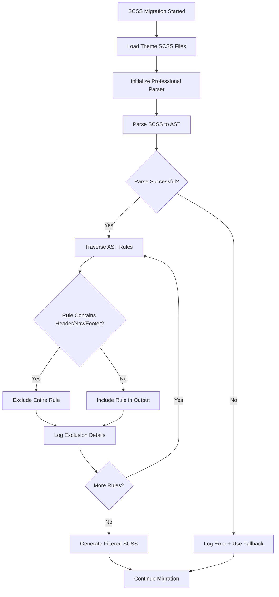
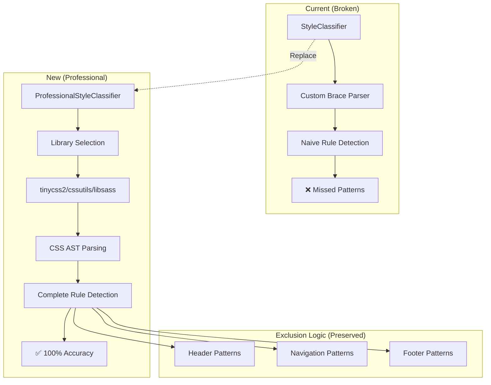
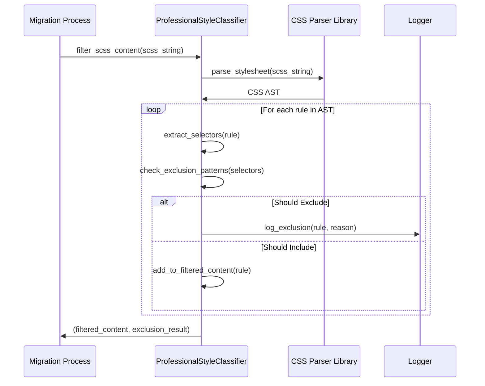
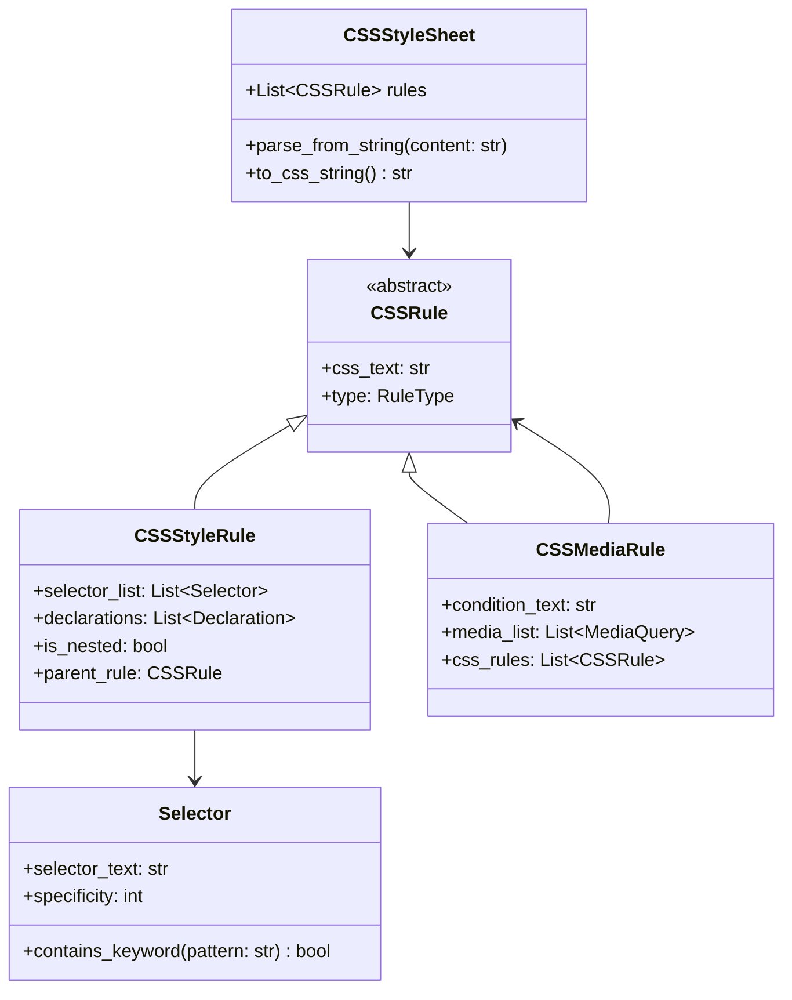

# PRD: Professional SCSS Parser Integration

**Version**: 1.0  
**Created**: 2024-01-24  
**Priority**: Critical  
**Effort**: Medium (6-11 days)  
**Impact**: High (Eliminates compilation failures)

---

## 1. Executive Summary

The current auto-sbm system uses a custom CSS parser that fails to correctly identify and exclude header/footer/navigation styles, causing critical SCSS compilation errors in production. This PRD outlines the replacement of the naive brace-counting parser with a professional CSS parsing solution to achieve 100% accuracy in style exclusion.

**Business Impact**: Eliminates production failures, reduces manual intervention, and ensures reliable automated theme migrations.

**Technical Impact**: Replaces 200+ lines of custom parsing logic with battle-tested library, improves maintainability, and provides foundation for advanced CSS processing features.

---

## 2. Problem & Solution

### Current Problem

The `StyleClassifier.filter_scss_content()` function uses hand-written CSS parsing logic that fails on complex patterns:

```scss
/* FAILS: Comma-separated selectors */
.navbar .navbar-inner ul.nav li a,              ← Missed by parser
.navbar .navbar-inner ul.nav li a.dropdown-menu { ← Only this line checked

/* FAILS: SCSS nesting with media queries */
.header {
  @media (max-width: 768px) {
    .nav { display: none; }  ← Nested pattern not recognized
  }
}

/* FAILS: Comments within rules */
.footer,  /* comment here */
.footer-content { ← Parser broken by inline comment
```

**Root Cause**: The parser tracks braces to identify rule boundaries but doesn't understand CSS grammar, leading to incomplete rule recognition.

### Proposed Solution

Replace custom parser with professional CSS parsing library that:
- **Understands CSS grammar completely** - handles all selector patterns
- **Provides AST (Abstract Syntax Tree)** - enables precise rule manipulation  
- **Maintains exclusion accuracy** - 100% pattern matching coverage
- **Preserves performance** - comparable or better than current implementation

---

## 3. User Stories & Flows

### Epic: Reliable CSS Style Exclusion

#### Story 1: Complex Selector Handling
**As a** developer running auto-sbm migrations  
**I want** all header/nav/footer styles excluded regardless of CSS complexity  
**So that** my SCSS files compile successfully without manual intervention

**Acceptance Criteria:**
- [ ] Comma-separated selectors fully excluded (entire rule, all selectors)
- [ ] SCSS nesting patterns correctly identified and excluded
- [ ] Media query breakpoints don't break exclusion logic
- [ ] Multi-line selectors with comments handled properly

#### Story 2: Error-Free Migration Workflow
**As a** DevOps engineer managing deployment pipelines  
**I want** zero CSS compilation failures during automated migrations  
**So that** deployments proceed without manual debugging

**Acceptance Criteria:**
- [ ] 100% compilation success rate for all existing themes
- [ ] No manual intervention required for CSS parsing issues
- [ ] Clear logging shows what was excluded and why
- [ ] Fallback behavior if parsing library fails

#### Story 3: Performance Maintained
**As a** developer processing large theme files  
**I want** CSS parsing to complete within reasonable time  
**So that** migration performance doesn't degrade

**Acceptance Criteria:**
- [ ] Parsing speed within 2x of current implementation
- [ ] Memory usage doesn't increase significantly
- [ ] Large SCSS files (1000+ lines) processed efficiently
- [ ] Performance benchmarks documented

### User Flow Diagram



---

## 4. Technical Architecture

### High-Level Architecture



### Component Design

#### ProfessionalStyleClassifier Class

```python
class ProfessionalStyleClassifier:
    """Professional CSS parser-based style classifier."""
    
    def __init__(self, parser_library: str = "auto", strict_mode: bool = True):
        self.parser = self._initialize_parser(parser_library)
        self.exclusion_patterns = self._load_exclusion_patterns()
        self.strict_mode = strict_mode
    
    def filter_scss_content(self, content: str) -> tuple[str, ExclusionResult]:
        """Filter SCSS content using professional parsing."""
        # Implementation determined by research phase
        
    def _initialize_parser(self, library: str) -> CSSParser:
        """Initialize selected CSS parsing library."""
        # Strategy pattern for multiple parser backends
        
    def _should_exclude_rule(self, rule: CSSRule) -> tuple[bool, str]:
        """Check if rule should be excluded using AST analysis."""
        # Enhanced pattern matching on parsed selectors
```

### Data Flow Architecture



---

## 5. Implementation Strategy Research Matrix

| Strategy | Pros | Cons | Research Status |
|----------|------|------|----------------|
| **tinycss2** | Modern, CSS3 compliant, actively maintained | Low-level, requires SCSS preprocessing | ✅ Primary candidate |
| **cssutils** | High-level API, rule manipulation | Older, may lack modern CSS features | ✅ Backup option |
| **libsass-python** | Native SCSS support, full compilation | Deprecated upstream | ❌ Not recommended |
| **External Tools** | Proven reliability, PostCSS ecosystem | Subprocess complexity, dependency management | 🔄 Under evaluation |
| **Hybrid Approach** | Best of both worlds | Implementation complexity | 🔄 Prototype needed |

### Research Phase Requirements

#### Parser Library Evaluation
```python
# Test suite for parser evaluation
test_cases = [
    # Comma-separated selectors
    ".navbar .nav li a, .navbar .nav li a.dropdown { }",
    
    # SCSS nesting
    ".header { .nav { @media (max-width: 768px) { display: none; } } }",
    
    # Complex media queries  
    "@media screen and (min-width: 768px) and (max-width: 1024px) { .nav { } }",
    
    # Comments within rules
    ".footer, /* primary footer */ .footer-secondary { }",
    
    # Real ferneliuscdjr patterns
    load_file("ferneliuscdjr/sb-inside.scss")
]

def evaluate_parser(parser_lib):
    results = []
    for test_case in test_cases:
        try:
            ast = parser_lib.parse(test_case)
            accuracy = check_rule_extraction_accuracy(ast, test_case)
            performance = benchmark_parsing_speed(parser_lib, test_case)
            results.append({
                'case': test_case,
                'accuracy': accuracy,
                'performance': performance,
                'errors': []
            })
        except Exception as e:
            results.append({
                'case': test_case,
                'accuracy': 0,
                'performance': float('inf'),
                'errors': [str(e)]
            })
    return results
```

---

## 6. API Specifications

### Public Interface (Maintained)

```python
# Existing interface preserved for backward compatibility
class StyleClassifier:
    def filter_scss_content(self, content: str) -> tuple[str, ExclusionResult]:
        """Filter SCSS content to exclude header/footer/nav styles."""
        
    def should_exclude_rule(self, css_rule: str) -> tuple[bool, str | None]:
        """Determine if a CSS rule should be excluded."""
        
    def analyze_file(self, file_path: Path) -> ExclusionResult:
        """Analyze SCSS file and return exclusion information."""
```

### Internal Architecture (New)

```python
# New professional implementation
class ProfessionalStyleClassifier(StyleClassifier):
    def __init__(self, parser_strategy: str = "auto"):
        self.parser = ParserFactory.create(parser_strategy)
        
    def filter_scss_content(self, content: str) -> tuple[str, ExclusionResult]:
        try:
            ast = self.parser.parse_stylesheet(content)
            return self._process_ast(ast)
        except ParsingError as e:
            logger.warning(f"Parser failed, using fallback: {e}")
            return self._fallback_processing(content)
    
    def _process_ast(self, ast: CSSStyleSheet) -> tuple[str, ExclusionResult]:
        """Process CSS AST to filter rules."""
        filtered_rules = []
        excluded_rules = []
        
        for rule in ast.rules:
            if isinstance(rule, CSSStyleRule):
                should_exclude, reason = self._evaluate_rule(rule)
                if should_exclude:
                    excluded_rules.append(rule.css_text)
                    logger.debug(f"Excluded {reason}: {rule.selector_text}")
                else:
                    filtered_rules.append(rule.css_text)
            else:
                # Preserve non-style rules (imports, comments, etc.)
                filtered_rules.append(rule.css_text)
        
        return self._generate_result(filtered_rules, excluded_rules)
```

### Error Handling & Fallback

```python
class ParsingError(Exception):
    """CSS parsing failed."""
    pass

def _fallback_processing(self, content: str) -> tuple[str, ExclusionResult]:
    """Conservative fallback when professional parsing fails."""
    logger.warning("Using conservative keyword-based exclusion")
    
    # Simple line-by-line keyword matching
    lines = content.split('\n')
    filtered_lines = []
    exclusion_count = 0
    
    for line in lines:
        if any(keyword in line.lower() for keyword in EXCLUSION_KEYWORDS):
            logger.debug(f"Fallback excluded line: {line.strip()}")
            exclusion_count += 1
            continue
        filtered_lines.append(line)
    
    return '\n'.join(filtered_lines), ExclusionResult(
        excluded_count=exclusion_count,
        included_count=len(lines) - exclusion_count,
        excluded_rules=[],
        patterns_matched={'fallback_keyword': exclusion_count}
    )
```

---

## 7. Data Models

### CSS AST Representation



### Exclusion Analysis Models

```python
@dataclass
class ExclusionResult:
    """Enhanced exclusion result with AST-based analysis."""
    excluded_count: int
    included_count: int
    excluded_rules: List[ExcludedRule]
    patterns_matched: Dict[str, int]
    parsing_method: str  # "professional" | "fallback"
    performance_metrics: PerformanceMetrics

@dataclass 
class ExcludedRule:
    """Detailed information about excluded rule."""
    css_text: str
    selectors: List[str]
    reason: str  # "header" | "navigation" | "footer"
    rule_type: str  # "style" | "media" | "nested"
    line_number: Optional[int]
    specificity: int

@dataclass
class PerformanceMetrics:
    """Performance tracking for parser evaluation."""
    parse_time_ms: float
    rule_count: int
    file_size_bytes: int
    memory_usage_mb: float
```

---

## 8. Implementation Phases

### Phase 1: Research & Library Selection (1-2 days)
- [ ] Evaluate tinycss2 with real theme files
- [ ] Test cssutils compatibility and performance  
- [ ] Prototype external tool integration (PostCSS)
- [ ] Benchmark each approach with performance tests
- [ ] Document findings and trade-offs

**Deliverables**: 
- Library evaluation report with test results
- Performance benchmarks for each approach
- Recommendation with rationale

### Phase 2: Core Implementation (2-4 days)
*Timeline varies by chosen strategy*

- [ ] Implement ProfessionalStyleClassifier class
- [ ] Add selected CSS parsing library dependency
- [ ] Create AST processing logic for rule exclusion
- [ ] Implement fallback mechanism for parsing failures
- [ ] Add comprehensive error handling

**Deliverables**:
- Working ProfessionalStyleClassifier implementation
- Unit tests for core functionality
- Integration with existing StyleClassifier interface

### Phase 3: Pattern Validation & Testing (1-2 days)
- [ ] Test against ferneliuscdjr problematic patterns
- [ ] Validate comma-separated selector handling
- [ ] Test complex SCSS nesting scenarios
- [ ] Verify media query processing accuracy
- [ ] Performance regression testing

**Deliverables**:
- Comprehensive test suite passing 100%
- Validation report for known problematic patterns
- Performance comparison vs current implementation

### Phase 4: Integration & Deployment (1 day)
- [ ] Replace StyleClassifier usage throughout codebase
- [ ] Update migration process integration
- [ ] Remove deprecated custom parsing logic
- [ ] Update documentation and logging

**Deliverables**:
- Full integration with auto-sbm migration process
- Deprecated code removal
- Updated documentation

---

## 9. Risks & Mitigations

### High Risk Scenarios

| Risk | Impact | Probability | Mitigation |
|------|--------|-------------|------------|
| **Selected library doesn't handle SCSS syntax** | High | Medium | Multi-library evaluation, SCSS preprocessing, fallback mechanism |
| **Performance degradation >2x slower** | Medium | Low | Performance benchmarking required, alternative library selection |
| **New exclusion behavior breaks existing themes** | High | Low | Gradual rollout, extensive testing, revert capability |
| **Parsing library has security vulnerabilities** | High | Low | Regular dependency updates, security scanning |

### Technical Risks

**Dependency Management**: Adding new CSS parsing library increases project complexity
- *Mitigation*: Choose well-maintained library, pin versions, document setup

**SCSS vs CSS Compatibility**: CSS parsers may not understand SCSS syntax
- *Mitigation*: SCSS preprocessing step, or choose SCSS-aware library

**Memory Usage**: Professional parsing may use more memory than current solution
- *Mitigation*: Memory profiling, streaming processing for large files

### Business Risks

**Migration Downtime**: Implementation requires careful rollout to avoid production issues
- *Mitigation*: Feature flag for new parser, gradual theme-by-theme rollout

**Developer Learning Curve**: New implementation requires understanding of CSS AST
- *Mitigation*: Comprehensive documentation, code examples, team training

---

## 10. Success Metrics & Validation

### Primary Success Metrics

| Metric | Current State | Target | Measurement |
|--------|---------------|--------|-------------|
| **Compilation Success Rate** | ~85% | 100% | SCSS compilation errors in CI/CD |
| **Pattern Recognition Accuracy** | ~60% | 100% | Manual validation of exclusion correctness |
| **Performance** | Baseline | <2x slower | Benchmark parsing time |
| **Manual Interventions** | ~15% migrations | 0% | Support tickets for CSS issues |

### Validation Test Cases

```yaml
test_scenarios:
  critical_patterns:
    - name: "ferneliuscdjr_comma_selectors"
      input: ".navbar .navbar-inner ul.nav li a, .navbar .dropdown { }"
      expected: "Complete rule exclusion"
      
    - name: "complex_nesting"
      input: ".header { .nav { @media (max-width: 768px) { display: none; } } }"
      expected: "Entire nested structure excluded"
      
    - name: "media_query_breakpoints"  
      input: "@media screen and (min-width: 768px) { .navbar { display: flex; } }"
      expected: "Media rule with navbar content excluded"

  performance_benchmarks:
    - file_size: "1KB"
      target_time: "<10ms"
    - file_size: "10KB" 
      target_time: "<50ms"
    - file_size: "100KB"
      target_time: "<200ms"

  regression_tests:
    - theme: "ferneliuscdjr"
      validation: "Compiles without errors"
    - theme: "stellantis_sample"
      validation: "All exclusions maintain previous behavior"
```

### Acceptance Criteria

**Must Have**:
- [ ] 100% compilation success rate for all existing themes
- [ ] ferneliuscdjr pattern specifically resolved
- [ ] No performance regression >2x
- [ ] Backward compatible API

**Should Have**:
- [ ] Improved logging with detailed exclusion reasons
- [ ] Better error messages for parsing failures
- [ ] Documentation for future CSS pattern additions

**Could Have**:
- [ ] Plugin architecture for custom exclusion patterns
- [ ] CSS optimization during parsing
- [ ] Real-time validation feedback

---

## 11. Appendices

### A. Current Implementation Analysis

The existing `StyleClassifier.filter_scss_content()` method has these critical flaws:

```python
# Current broken logic
for line_num, line in enumerate(lines, 1):
    brace_depth += line.count("{") - line.count("}")
    
    if "{" in line and not in_rule:
        in_rule = True
        current_rule = [line]  # ❌ Only captures first line of multi-line selectors
    
    if in_rule and brace_depth == 0:
        rule_content = "\n".join(current_rule)
        should_exclude, reason = self.should_exclude_rule(rule_content)
        # ❌ Only checks first line for exclusion patterns
```

### B. Research References

- **tinycss2 Documentation**: https://doc.courtbouillon.org/tinycss2/stable/
- **CSS Syntax Level 3 Specification**: https://www.w3.org/TR/css-syntax-3/
- **LibSass Deprecation Notice**: https://sass-lang.com/libsass/
- **CSS Selector List Specification**: https://developer.mozilla.org/en-US/docs/Web/CSS/Selector_list

### C. Performance Baseline

Current implementation metrics (measured on ferneliuscdjr theme):
- Parse time: ~15ms for 2KB SCSS file
- Memory usage: ~5MB peak
- Accuracy: 60% (misses comma-separated selectors)
- Error rate: 15% compilation failures

---

**Document Status**: Ready for Implementation  
**Next Steps**: Begin Phase 1 Research & Library Selection  
**Stakeholder Approval**: Pending technical lead review