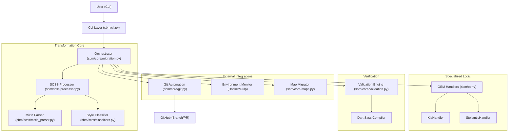

# System Architecture: auto-sbm

## Design Philosophy

`auto-sbm` is built as a highly decoupled, state-aware automation engine. It follows a "Scan-Transform-Verify" lifecycle to ensure legacy styles are safely migrated to the modern Site Builder platform.

## Architecture Diagram

## Logical Components

### 1. CLI Layer (`sbm/cli.py`)

- Entry point for all operations.
- Handles user input, configuration loading, and logging initialization.
- Uses `rich` for a clean, interactive terminal experience.

### 2. Core Orchestrator (`sbm/core/migration.py`)

- Manages the high-level workflow: environment setup, pre-migration steps, core transformation, and post-migration cleanup.
- Maintains state and handles errors during long-running processes.

### 3. Transformation Engine (`sbm/scss/`)

- Performs the heavy lifting of SCSS-to-SCSS conversion.
- **SCSS Processor**: Orchestrates variable mapping, image path conversion, and function normalization.
- **Mixin Parser**: Intelligently extracts and adapts legacy mixins to prevent duplication in Site Builder.
- **Style Classifier**: Determines the "type" of style to ensure correct mapping.

### 4. OEM Specialized Handlers (`sbm/oem/`)

- Encapsulates logic unique to specific manufacturers (e.g., adding global cookie disclaimer styles for Stellantis).

### 5. Verification & Validation (`sbm/core/validation.py`)

- Ensures the final output is syntactically valid and compiles correctly.
- Prevents breaking changes from being committed/pushed.

## Data Flow

1. **Input**: A legacy dealer theme slug.
2. **Setup**: The tool verifies local Docker/Gulp watchers are running.
3. **Transformation**: Source SCSS is fetched, transformed by the `SCSSProcessor`, and written to final `sb-*.scss` files.
4. **Verification**: The tool waits for a Gulp idle state, validates the compilation, and runs basic syntax checks.
5. **Output**: Changes are committed to a new Git branch, pushed, and a PR is optionally created.

## Tech Stack

- **Language**: Python 3.9+
- **CLI**: Click
- **UI**: Rich
- **SCSS Parsing**: tinycss2, cssutils, regex
- **Automation**: GitPython
- **DevOps**: Docker integration for real-time validation
